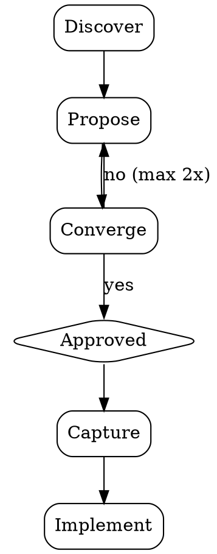

# Simple Brainstorm

A structured yet lightweight brainstorming skill designed to move from idea to actionable direction quickly. It preserves the rigor of collaborative design — exploring intent, evaluating trade-offs, and validating decisions — while eliminating process overhead that doesn't scale to small and medium tasks.

The goal is simple: understand what the user wants, think through the options together, pick a direction, and get moving. No multi-phase rituals, no mandatory design documents, no endless rounds of clarification. Just enough structure to make good decisions, and nothing more.

## Ground Rules

Do NOT write any code, scaffold any files, or take any implementation action until the user has explicitly approved a direction. This applies even when the task seems obvious. The whole point of brainstorming is to pause and think before building. Respect that boundary.

## Flow

## Process

### 1. Discover

Start by understanding what you're working with. Look at the project — its codebase, conventions, folder structure, and any existing patterns that are relevant to the task at hand.

Then ask the user up to 3 focused questions to clarify their intent, constraints, and what success looks like. Prefer multiple-choice options when you can — they're faster for the user to answer and they show you've already thought about the problem. If questions are related, batch them into a single message rather than asking one at a time.

The point of discovery is to fill in gaps, not to interrogate. If the user's request is already clear, you can keep this step short or skip straight to proposing.

### 2. Propose

Present 2 distinct approaches. For each one, explain what it involves and what the trade-offs are — what you gain, what you give up, and any risks or assumptions worth noting.

Lead with the approach you'd recommend, and be clear about why you prefer it. Keep each option concise — a short paragraph is usually enough. You want to give the user real information to decide on, not bury them in detail.

If the task is small or straightforward, the two options might just be "do it this way" vs "do it that way" in a few sentences each. For bigger tasks, spend a bit more time laying out the reasoning. Use your judgment.

### 3. Converge

Get the user's explicit go-ahead on one of the approaches. If they push back or want changes, revise and propose again — but limit yourself to two rounds of proposals. If you're still not aligned after that, stop guessing and ask the user to describe what they want in their own words.

The goal here is to reach a clear decision, not to keep iterating until you've covered every possibility. A good-enough direction chosen quickly beats a perfect direction chosen slowly.

### 4. Capture

Once a direction is approved, briefly record what was decided — the approach, the reasoning, and any key decisions that were made along the way. You can do this as a short inline comment at the top of the first file you create, or just share it in chat.

Don't create a separate design document unless the user asks for one. For most tasks, the decision context lives naturally in the conversation and in the code itself. Formal artifacts should be reserved for work that other people will need to reference later.

## Principles

- **Speed over ceremony** — The value of brainstorming is in the thinking, not in the artifacts it produces. Skip formality wherever it doesn't add real value. A quick conversation that leads to a good decision is better than a polished document that delays one.

- **YAGNI** — Design only for what's needed right now. Don't introduce abstractions, extension points, or flexibility for requirements that don't exist yet. If they come up later, you can handle them then. Speculative design creates more problems than it solves.

- **Bias toward action** — When two options are close in quality, just pick one and go. Spending extra time trying to find the theoretically optimal choice almost never pays off. Movement creates clarity. You'll learn more from building than from deliberating.

- **Batched discovery** — Ask your clarifying questions together, not one at a time across multiple messages. Drawn-out discovery wastes the user's time and breaks their flow. Get what you need in one round and move forward.

- **Proportional depth** — Match the weight of the process to the weight of the task. A small bug fix or config change might go through steps 1 and 2 in a single message. A new subsystem deserves a more thorough exploration in step 2. Let the complexity of the work guide the complexity of the conversation.
